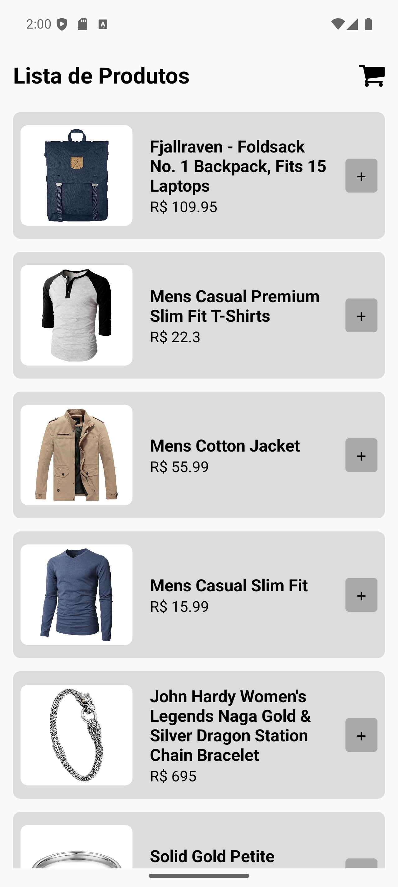
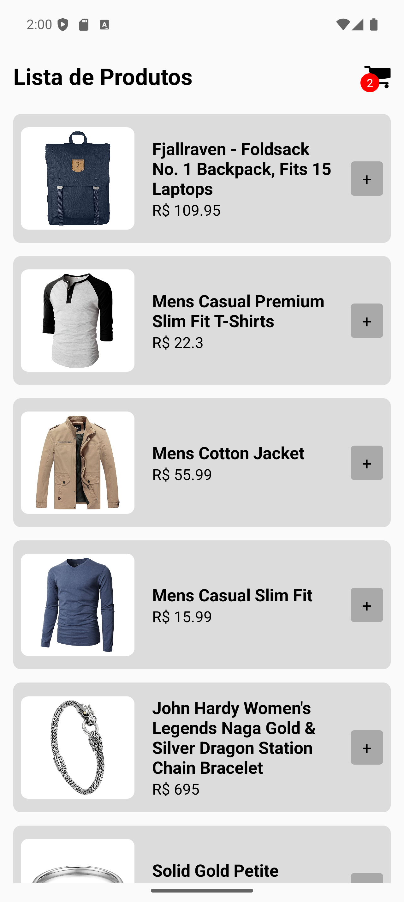

# 🛒 CarrinhoApp

Um aplicativo de carrinho de compras desenvolvido em **React Native**, com consumo de API externa e gerenciamento de estado usando **Context API**.

## 🚀 Funcionalidades

- Listagem de produtos consumidos da [FakeStoreAPI](https://fakestoreapi.com/)
- Adicionar produtos ao carrinho
- Exibir quantidade de itens no carrinho em tempo real
- Visualização dos itens adicionados


## 📦 Tecnologias Utilizadas

- [React Native](https://reactnative.dev/)
- [React Navigation](https://reactnavigation.org/)
- [Axios](https://axios-http.com/)
- [Context API](https://reactjs.org/docs/context.html)
- [React Native Vector Icons](https://github.com/oblador/react-native-vector-icons)

## ▶️ Executando o projeto

1. Clone o repositório:

```bash
git clone https://github.com/leandrovelosos/AppCarrinho.git
```


```bash 
npm install
```

```bash
npm run android
```

## 📷 Screenshots


<hr>


<hr>
